# 내 컴퓨터에 개발자용 '작업실' 꾸미기

> Codyssey 입학 연수 2기 · 개발 입문 · 개발 워크스테이션 구축 미션 제출물
> **서울캠퍼스 환경**: sudo 권한 제약으로 인해 Docker Desktop 대신 **OrbStack**을 사용해 컨테이너 엔진을 구동했습니다. (`docker` 명령어 사용법은 동일)

---

## 📑 목차

1. [프로젝트 개요](#1-프로젝트-개요)
2. [실행 환경](#2-실행-환경)
3. [수행 체크리스트](#3-수행-체크리스트)
4. [터미널 기본 조작](#4-터미널-기본-조작)
5. [파일 권한(Permission) 실습](#5-파일-권한permission-실습)
6. [Docker 설치 및 점검](#6-docker-설치-및-점검)
7. [Docker 기본 운영 명령](#7-docker-기본-운영-명령)
8. [컨테이너 실행 실습](#8-컨테이너-실행-실습)
9. [Dockerfile 기반 커스텀 이미지](#9-dockerfile-기반-커스텀-이미지)
10. [포트 매핑 및 접속 증거](#10-포트-매핑-및-접속-증거)
11. [바인드 마운트(변경 반영)](#11-바인드-마운트변경-반영)
12. [Docker 볼륨(데이터 영속성)](#12-docker-볼륨데이터-영속성)
13. [Git 설정 및 GitHub / VSCode 연동](#13-git-설정-및-github--vscode-연동)
14. [보안 및 개인정보 보호](#14-보안-및-개인정보-보호)
15. [보너스 과제](#15-보너스-과제)
16. [트러블슈팅](#16-트러블슈팅)

---

## 1. 프로젝트 개요
개발은 코드를 작성하는 순간이 아니라 환경을 세팅하는 순간부터 시작됩니다. 이 미션은 코드가 "내 컴퓨터에서만" 돌아가는 문제를 줄이고, 팀원 누구나 같은 방식으로 실행·배포·디버깅할 수 있는 재현 가능한 개발 환경을 만드는 것을 목표로 합니다.

- **터미널(리눅스 CLI)** — 작업 디렉토리와 권한 정리
- **Docker(컨테이너)** — 격리된 실행 환경 구성, 이미지/컨테이너 분리
- **Git / GitHub** — 로컬 버전관리 + 원격 협업

---

## 2. 실행 환경

| 항목 | 값 |
|------|------|
| 기기 | iMac Retina 5K 27-inch 2019 |
| OS | macOS Sequoia 15.7.4 |
| CPU | 3.1 GHz 6-Core Intel Core i5 |
| 메모리 | 32 GB 2667 MHz DDR4 |
| Shell | zsh (macOS 기본 셸, `.zsh_sessions` 확인) |
| 컨테이너 엔진 | **OrbStack** (Docker 엔진 내장) |
| Docker | 28.5.2 (build ecc6942) |
| Git | 2.53.0 |

> 📸 **OrbStack 실행 화면**
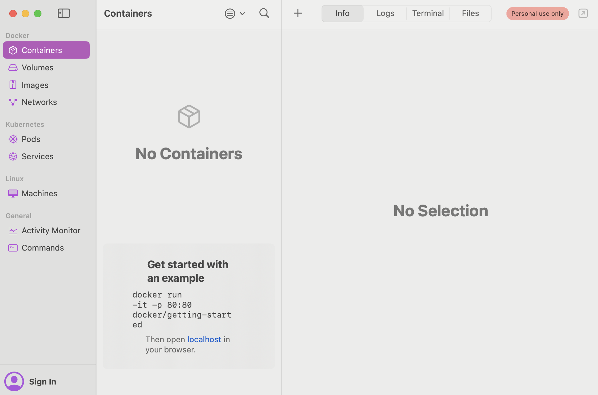

---

## 3. 수행 체크리스트

- [o] 터미널 기본 조작 및 폴더 구성
- [o] 파일/디렉토리 권한 변경 실습
- [o] Docker 설치 / 데몬 점검
- [o] `hello-world` 실행
- [o] `ubuntu` 컨테이너 진입 및 명령 실행
- [o] Dockerfile 빌드 / 실행
- [o] 포트 매핑 접속 (2회)
- [o] 바인드 마운트 변경 반영
- [o] 볼륨 영속성 검증
- [o] Git 설정 + GitHub / VSCode 연동

---

## 4. 터미널 기본 조작

> 📌 **개념 정리**
> - **절대 경로**: 루트(`/`)부터 시작하는 전체 경로. 예) `/home/user/codyssey`
> - **상대 경로**: 현재 위치(`.`) 기준 경로. 예) `./practice`, 상위는 `..`

```bash
pwd
# print working directory
# 현재 작업 디렉토리의 "절대 경로"를 출력한다. 지금 내가 어디에 있는지 확인.

ls -la
# list (목록 출력)
#   -l : long format. 권한 / 소유자 / 그룹 / 크기 / 수정일시 등 상세 정보 표시
#   -a : all. '.'으로 시작하는 숨김 파일(.git, .env 등)까지 포함
# (-la는 -l과 -a를 합친 옵션)

mkdir -p ~/codyssey/practice
# make directory
#   -p : parents. 중간 경로(codyssey)가 없어도 한 번에 생성하고,
#        이미 존재해도 에러 없이 통과. (~ 는 홈 디렉토리)

cd ~/codyssey/practice
# change directory. 지정한 디렉토리로 이동 (인자 없이 cd 만 쓰면 홈으로 이동)

touch memo.txt
# 내용이 없는 "빈 파일" 생성. (원래는 파일의 접근/수정 시각을 갱신하는 명령)

cp memo.txt memo_backup.txt
# copy. 원본(memo.txt)을 새 이름(memo_backup.txt)으로 복사
#   (디렉토리 통째로 복사할 땐 -r 옵션: cp -r 원본디렉토리 대상디렉토리)

mv memo_backup.txt notes.txt
# move. 파일을 이동하거나 "이름 변경"에 사용 (같은 위치로 옮기면 rename 효과)

cat notes.txt
# concatenate. 파일 내용을 터미널에 그대로 출력

rm notes.txt
# remove. 파일 삭제
#   ※ 디렉토리 삭제는 rm -r (재귀), 강제 삭제는 rm -rf → -f(force)는 신중히 사용
```

> 📸 **터미널 기본 조작**
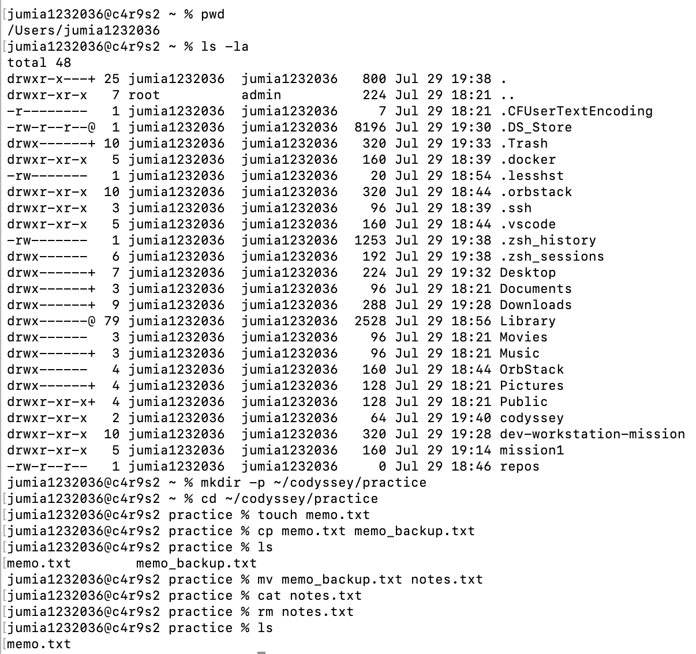

---

## 5. 파일 권한(Permission) 실습

> 📌 **개념 정리**
> 권한은 `r`(읽기=4) / `w`(쓰기=2) / `x`(실행=1) 3비트로 구성되고, **소유자 / 그룹 / 그외** 순서로 3자리 숫자로 표기합니다.
> - `755` = `rwx r-x r-x` → 소유자는 모두, 나머지는 읽기+실행 (실행 파일/디렉토리에 흔함)
> - `644` = `rw- r-- r--` → 소유자는 읽기+쓰기, 나머지는 읽기만 (일반 문서 파일에 흔함)

```bash
# --- 파일 1개 권한 변경 ---
touch sample.sh              # 실습용 파일 생성

ls -l sample.sh
# 변경 "전" 권한 확인 (예: -rw-r--r-- → 644)

chmod 755 sample.sh
# change mode. 권한을 8진수로 지정
#   7(rwx) 5(r-x) 5(r-x) → 소유자 실행권한 추가

ls -l sample.sh
# 변경 "후" 권한 확인 (예: -rwxr-xr-x → 755)


# --- 디렉토리 1개 권한 변경 ---
mkdir secret_dir             # 실습용 디렉토리 생성

ls -ld secret_dir
# -d : 디렉토리 "자신"의 정보를 표시 (내부 목록이 아니라 디렉토리 권한을 봄)
# 변경 "전" 권한 확인

chmod 700 secret_dir
# 7(rwx) 0(---) 0(---) → 소유자만 접근 가능, 그룹/그외는 접근 불가

ls -ld secret_dir
# 변경 "후" 권한 확인
```

> 📸 **파일 권한 실습**
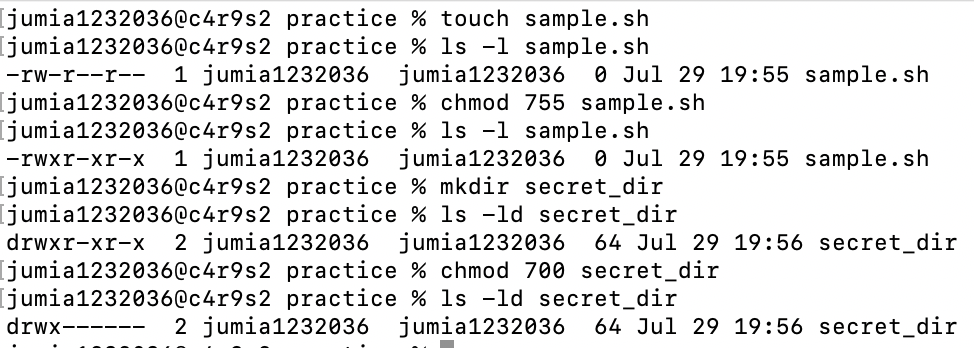

---

## 6. Docker 설치 및 점검

```bash
docker --version
# Docker CLI 버전 확인. 설치가 정상적으로 됐는지 가장 먼저 점검
# 예) Docker version 26.1.4, build ...

docker info
# 데몬(엔진) 동작 여부 + 상세 정보(컨테이너 수, 이미지 수, 스토리지 드라이버 등)
# ※ 이 명령이 정상 출력되면 "Docker 데몬이 살아있다"는 뜻
#    (OrbStack 앱이 꺼져 있으면 여기서 연결 에러가 남)
```

> 📸 **Docker 점검**
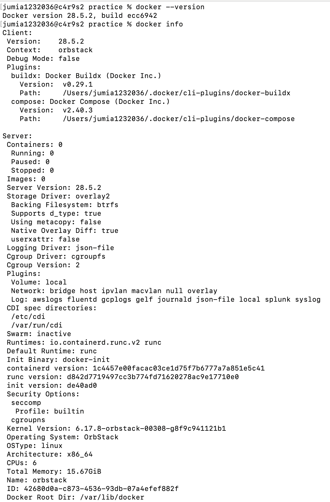

---

## 7. Docker 기본 운영 명령

```bash
docker pull nginx:alpine
# 레지스트리(Docker Hub)에서 이미지를 로컬로 다운로드
#   nginx:alpine → "이미지이름:태그". 태그 생략 시 latest

docker images
# 로컬에 저장된 이미지 목록 (REPOSITORY / TAG / IMAGE ID / SIZE)

docker ps
# 현재 "실행 중인" 컨테이너 목록만 표시

docker ps -a
# -a : all. 중지된 컨테이너까지 "모든" 컨테이너 표시

docker logs <컨테이너이름>
# 해당 컨테이너의 표준 출력 로그 확인
#   -f 옵션을 붙이면(follow) 실시간으로 로그를 계속 따라감

docker stats
# 컨테이너별 실시간 리소스 사용량(CPU/메모리/네트워크 I/O) 모니터링
#   (종료: Ctrl + C)
```

> 📸 **Docker 운영**
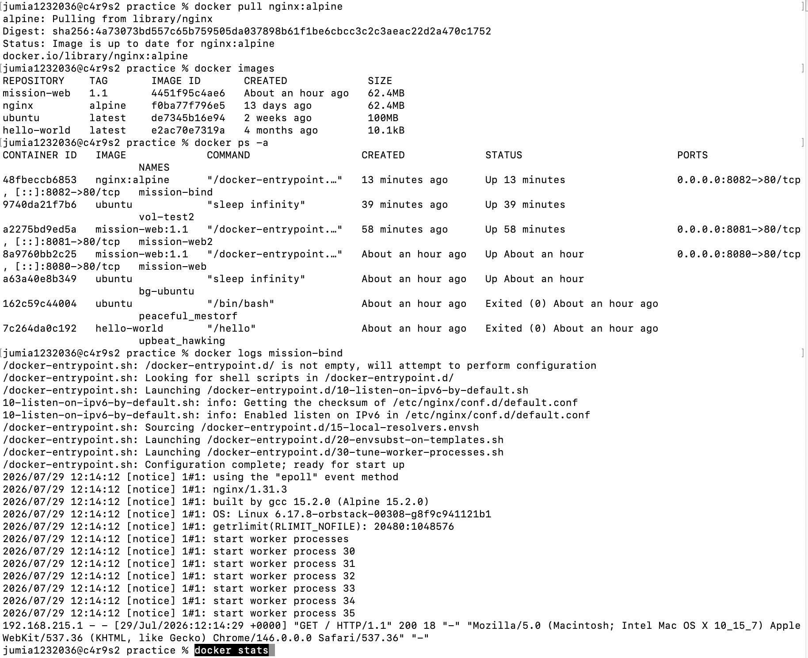
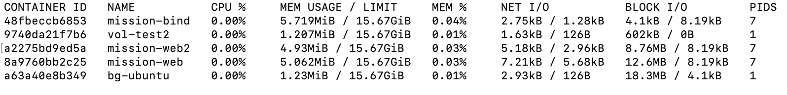

---

## 8. 컨테이너 실행 실습

```bash
docker run hello-world
# 이미지가 없으면 자동으로 pull → 컨테이너 실행.
# 설치가 정상인지 확인하는 "가장 기본" 테스트 컨테이너
# hello-world 이미지를 가지고 컨테이너를 만들어서 실행(Start)까지 하라는 강력한 명령어
```

> 📸 **컨테이너 실습**
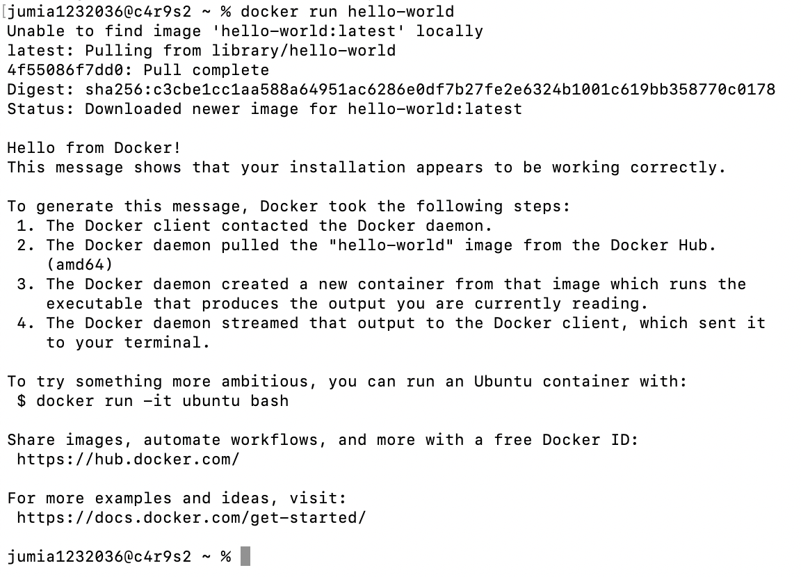

```bash
docker run -it ubuntu
# ubuntu 컨테이너를 실행하며 "내부 셸로 진입"
#   -i : interactive. 입력(STDIN)을 열어둠 (내가 타이핑 가능)
#   -t : tty. 가상 터미널 할당 (프롬프트가 제대로 보임)
#   → 보통 -it 를 붙여 대화형으로 진입

# (컨테이너 내부에서)
ls          # 컨테이너 내부 파일 목록
echo "hello from container"   # 문자열 출력 → 컨테이너 안에서 명령이 도는지 확인
exit        # 셸 종료 → 컨테이너도 함께 종료됨
```

> 📸 **ubuntu 컨테이너 실습**
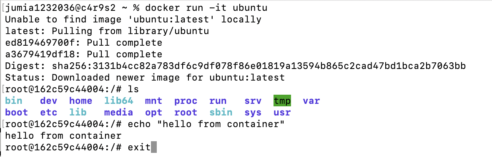

### attach vs exec 차이 (직접 관찰 정리)

```bash
docker run -d --name bg-ubuntu ubuntu sleep infinity
# -d : detached. 백그라운드로 실행 (터미널을 점유하지 않음)
# --name : 컨테이너에 이름 부여 (id 대신 이름으로 다루기 편함)
# sleep infinity : 컨테이너가 바로 안 꺼지도록 무한 대기시키는 트릭

docker exec -it bg-ubuntu bash
# 실행 중인 컨테이너에 "새 프로세스(bash)"를 붙여 진입.
# → 여기서 exit 해도 원래 컨테이너는 계속 살아있음 ✅
# 내가 들어간 문은 메인 방의 생명줄과 상관없는 '새로운 통로'.
# exit를 입력하고 나와도, 원래 방(컨테이너)과 안에서 돌고 있던 메인 프로세스는 아무런 타격 없이 계속 작동

docker attach bg-ubuntu
# 컨테이너의 "메인 프로세스"에 직접 연결.
# → 여기서 Ctrl+C 등으로 나가면 메인 프로세스가 죽어 컨테이너도 종료될 수 있음 ⚠️
# 현재 컨테이너의 목숨줄인 '메인 프로세스' 화면을 그대로 보고 있음.
# 안전하게 탈출: Ctrl + P를 누른 상태에서 이어서 Q를 누르는 특수 단축키(Ctrl + P, Q)를 사용
```

> **관찰 요약**: `exec`는 별도 프로세스라 나가도 컨테이너가 유지되고, `attach`는 메인 프로세스에 붙는 것이라 조작에 따라 컨테이너가 종료될 수 있다.

---

## 9. Dockerfile 기반 커스텀 이미지

**NGINX 베이스 이미지 + 정적 콘텐츠 교체**

### 사전 준비: `site/index.html` 생성

```bash
mkdir site
# COPY의 복사 대상이 될 site 폴더 생성

cat > site/index.html << 'EOF'
<!DOCTYPE html>
<html lang="ko">
<head>
  <meta charset="UTF-8">
  <title>Mission Web</title>
</head>
<body>
  <h1>개발자용 작업실 꾸미기 미션</h1>
  <p>Docker + NGINX 커스텀 이미지 실행 성공</p>
</body>
</html>
EOF
# cat > 파일명 : 내용을 파일에 덮어쓰기
# << 'EOF' ~ EOF : heredoc. 여러 줄 텍스트를 파일로 한 번에 작성하는 방법
#   (작은따옴표 'EOF'로 감싸면 $변수 등이 그대로 문자열로 들어감)

ls -l site/
# site/index.html 이 정상 생성됐는지 확인
```

### Dockerfile

```dockerfile
# FROM : 공식 NGINX 웹 서버 이미지를 베이스 이미지 지정. alpine은 경량 리눅스라 이미지 크기가 작음
FROM nginx:alpine

# LABEL : 이미지 메타데이터(설명). 운영 시 이미지 식별에 도움
LABEL org.opencontainers.image.title="mission-web"

# ENV : 컨테이너 안에서 쓸 환경 변수 지정 (설정과 코드의 분리)
# 이 컨테이너가 실행되는 환경이 '개발용(dev)'인지 '실제 서비스용(prod)'인지 컨테이너 안의 프로그램들에게 알려주는 역할
ENV APP_ENV=dev

# COPY : 호스트의 파일을 이미지 안으로 복사
#   site/ (내 정적 파일)  →  NGINX 웹 루트로 교체
#   ※ 경로 주의: NGINX 실제 웹 루트는 /usr/share/nginx/html
COPY site/ /usr/share/nginx/html/

# EXPOSE : 이 컨테이너 내부에서 웹 서버가 80번 포트를 사용해 대기 중입니다"라고 안내하는 문서용 명시 (실제 개방은 -p 로 함)
EXPOSE 80
```

### 커스텀 포인트 요약

| 커스텀 포인트 | 목적 |
|------|------|
| `FROM nginx:alpine` | 검증된 웹서버를 베이스로 재사용, 경량화 |
| `COPY site/ ...` | 기본 페이지를 내 정적 콘텐츠로 교체 |
| `ENV APP_ENV=dev` | 환경별 설정을 코드와 분리 |
| `LABEL` | 이미지 식별/문서화 |

### 빌드 & 실행

```bash
docker build -t mission-web:1.1 .
# build : Dockerfile로 이미지 생성
#   -t : tag. 이미지 이름:버전 지정 (mission-web:1.1)
#   .  : build context. 현재 디렉토리를 빌드 대상으로 사용 (Dockerfile 위치)

docker run -d -p 8080:80 --name mission-web mission-web:1.1
# -d : 백그라운드 실행
# -p 8080:80 : 포트 매핑 (호스트 8080 → 컨테이너 80)
# --name : 컨테이너 이름 지정
```

> 📸 **커스텀 이미지 빌드**
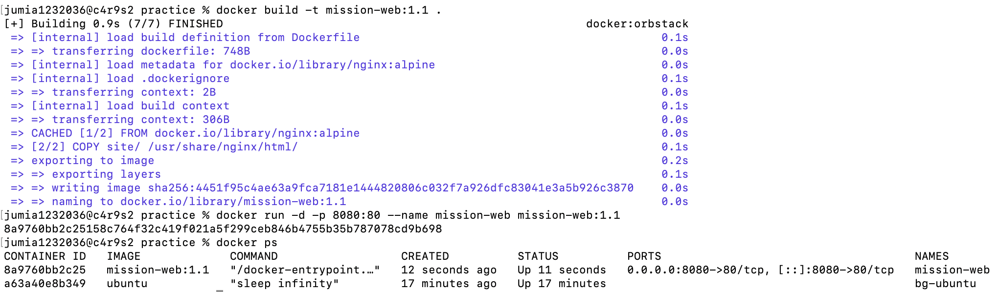

---

## 10. 포트 매핑 및 접속 증거

> 📌 **왜 필요한가**
> 컨테이너는 격리된 별도 네트워크를 가집니다. 컨테이너 내부의 포트(80)는 밖에서 바로 안 보이므로, **호스트 포트와 연결(매핑)** 해줘야 브라우저로 접속할 수 있습니다.

```bash
# 형식: -p <호스트포트>:<컨테이너포트>

docker run -d -p 8080:80 --name mission-web mission-web:1.1
# 호스트 8080 → 컨테이너 80 으로 연결 (첫 번째 접속)

docker run -d -p 8081:80 --name mission-web2 mission-web:1.1
# 호스트 8081 → 컨테이너 80 으로 연결 (두 번째 접속, 포트만 다르게)

curl http://localhost:8080
# 터미널에서 HTTP 응답을 텍스트로 확인 (브라우저 없이 접속 검증)

curl http://localhost:8081
```

> 📸 **8080 포트 매핑**
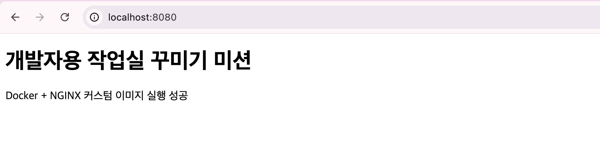

> 📸 **8081 포트 매핑**
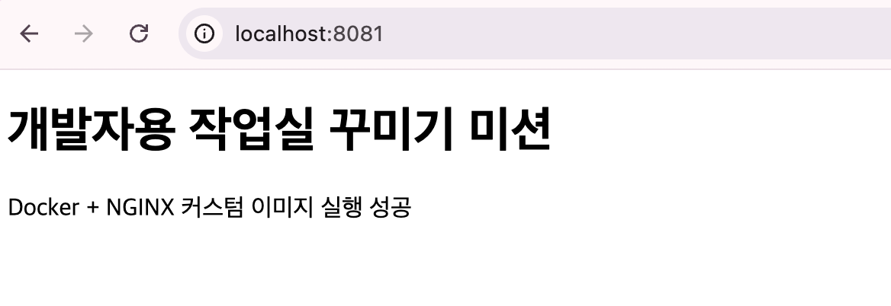
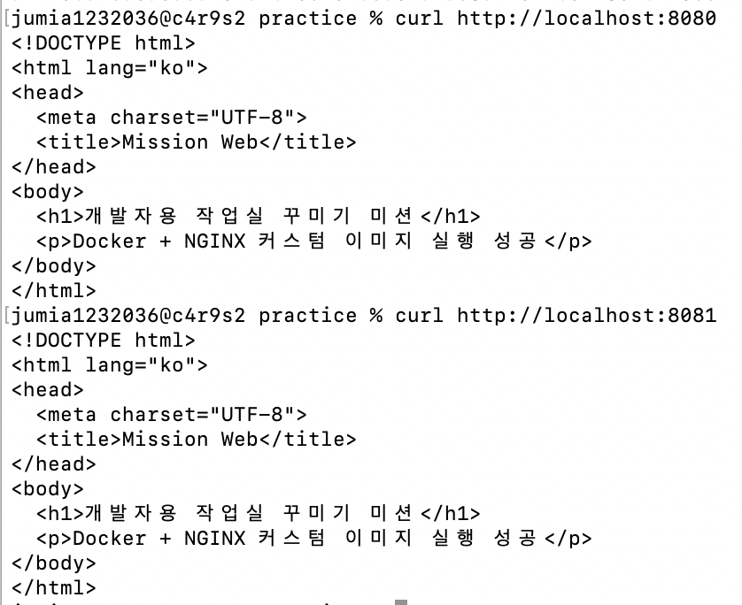

---

## 11. 바인드 마운트(변경 반영)

> 📌 **개념**
> 바인드 마운트는 **호스트의 실제 폴더**를 컨테이너 안에 그대로 연결합니다. 호스트에서 파일을 수정하면 컨테이너에 **즉시 반영**되어, 매번 다시 빌드하지 않고 개발할 수 있습니다.

```bash
docker run -d \
  --name mission-bind \
  -p 8082:80 \
  -v "$(pwd)/site:/usr/share/nginx/html" \
  nginx:alpine
# -v <호스트경로>:<컨테이너경로> : 바인드 마운트
#   $(pwd)/site : 현재 위치의 site 폴더 (반드시 절대경로여야 함 → $(pwd) 사용)
#   :/usr/share/nginx/html : NGINX의 실제 웹 루트에 연결
```

### 마운트 검증

```bash
docker inspect mission-bind --format '{{json .Mounts}}'
# inspect : 컨테이너의 상세 설정을 JSON으로 출력
#   --format '{{json .Mounts}}' : 전체 중 "Mounts(마운트 정보)"만 뽑아서 표시
#   → Source(호스트경로)와 Destination(컨테이너경로)가 의도대로 연결됐는지 확인

docker exec mission-bind cat /usr/share/nginx/html/index.html
# 컨테이너 안의 웹 루트 파일 내용 출력
#   → 호스트 site/index.html 이 컨테이너에 그대로 연결됐는지 최종 확인
# 켜져 있는 mission-bind 컨테이너 내부에 들어가서, NGINX가 보여주는 웹 페이지 파일(index.html)의 텍스트 내용을 터미널 창에 그대로 출력(cat)하라는 명령어
```

### 변경 반영 테스트

```bash
curl http://localhost:8082                    # 변경 "전" 내용 확인
echo '<h1>Updated!</h1>' > site/index.html    # 호스트 파일 수정
curl http://localhost:8082                     # 재빌드 없이 변경이 "즉시 반영"되는지 확인
```

> 📸 **바인드 마운트**
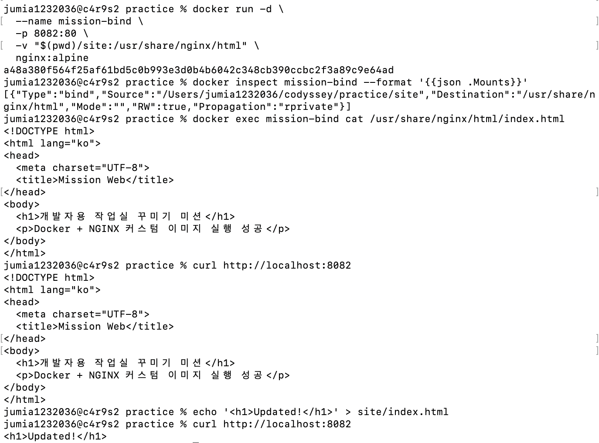
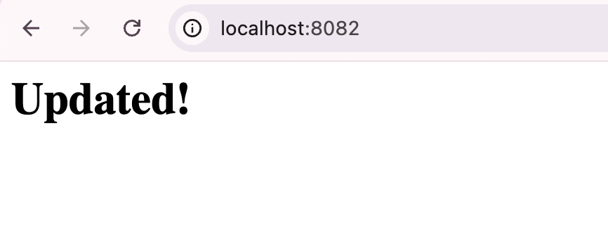

---

## 12. Docker 볼륨(데이터 영속성)

> 📌 **개념**
> 컨테이너를 삭제하면 내부 데이터도 사라집니다. **볼륨**은 데이터를 컨테이너 바깥(Docker가 관리하는 영역)에 저장하므로, 컨테이너를 지웠다 다시 만들어도 **데이터가 유지**됩니다.

```bash
docker volume create mydata
# 이름이 mydata 인 도커 볼륨 생성

docker run -d --name vol-test -v mydata:/data ubuntu sleep infinity
# -v mydata:/data : 볼륨 mydata 를 컨테이너의 /data 에 연결

docker exec -it vol-test bash -lc "echo hi > /data/hello.txt && cat /data/hello.txt"
# 컨테이너 안에서 /data/hello.txt 에 데이터 기록 후 출력
#   bash -lc "..." : 로그인 셸(-l)로 문자열 명령(-c)을 실행

# --- 컨테이너 삭제 (데이터가 살아남는지 검증) ---
docker rm -f vol-test
# rm : 컨테이너 삭제
#   -f : force. 실행 중이어도 강제로 중지 후 삭제

# --- 새 컨테이너에 같은 볼륨 연결 → 데이터 확인 ---
docker run -d --name vol-test2 -v mydata:/data ubuntu sleep infinity

docker exec -it vol-test2 bash -lc "cat /data/hello.txt"
# 이전에 기록한 'hi' 가 그대로 출력되면 → 데이터 영속성 검증 성공 ✅
```

> 📸 **볼륨 영속성**
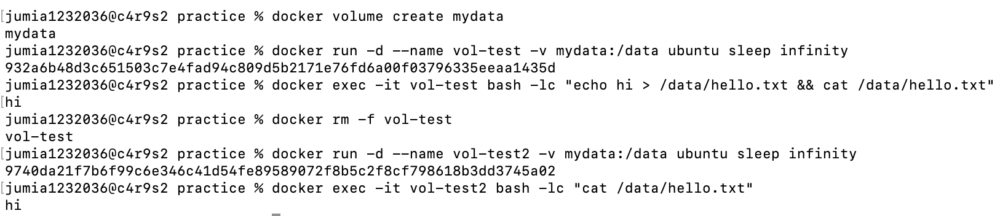

---

## 13. Git 설정 및 GitHub / VSCode 연동

> 📌 **역할 차이**
> - **Git**: 내 컴퓨터에서 돌아가는 **로컬 버전관리** 도구 (커밋 이력 관리)
> - **GitHub**: Git 저장소를 올려두고 함께 작업하는 **원격 협업 플랫폼**

```bash
git config --global user.name "Your Name"
# --global : 이 사용자 계정 전체에 적용되는 설정
# 커밋에 기록될 작성자 이름 지정

git config --global user.email "you@example.com"
# 커밋에 기록될 이메일 지정 (GitHub 계정 이메일과 맞추면 연동 편리)

git config --global init.defaultBranch main
# 새 저장소(git init) 생성 시 기본 브랜치 이름을 main 으로 지정

git config --list
# 현재 적용된 Git 설정 전체를 출력 (설정이 잘 됐는지 확인)
```

**VSCode ↔ GitHub 연동 순서**
1. VSCode에서 GitHub 계정으로 로그인 (Accounts → Sign in with GitHub)
2. 소스 제어(Source Control) 패널에서 저장소 연결/커밋/푸시

> 📸 **Git 연동**
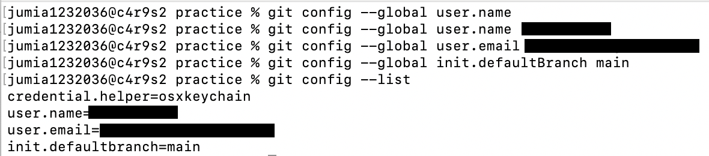

> 📸 **VSCode에서 GitHub 연동**
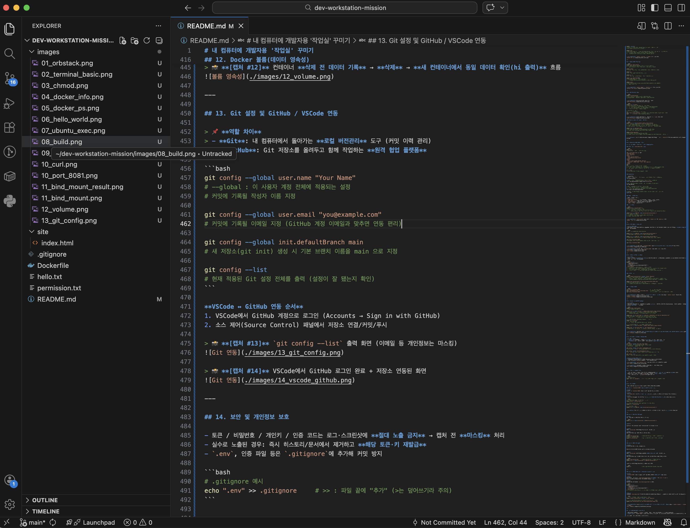

---

## 14. 보안 및 개인정보 보호

- 토큰 / 비밀번호 / 개인키 / 인증 코드는 로그·스크린샷에 **절대 노출 금지** → **마스킹** 처리
- 실수로 노출된 경우: 즉시 히스토리/문서에서 제거하고 **해당 토큰·키 재발급**
- `.env`, 인증 파일 등은 `.gitignore`에 추가해 커밋 방지

```bash
# .gitignore 예시
echo ".env" >> .gitignore     # >> : 파일 끝에 "추가" (>는 덮어쓰기라 주의)
```

---

## 15. 보너스 과제

---

### 보너스 1. Docker Compose 기초

> 📌 **배움 포인트**: docker-compose.yml은 한 마디로 여러 개의 컨테이너를 한꺼번에 정의하고 실행하기 위한 설계도이다. `docker run` 명령어를 매번 타이핑하는 대신, 실행 설정을 파일로 "문서화"할 수 있다. 팀원과 동일한 설정으로 실행하기 쉬워진다. services는 Docker Compose에서 실행할 컨테이너(서비스)들을 정의하는 영역이다.

```yaml
# docker-compose.yml
services:
  web:
    # image : 사용할 이미지 (docker run의 마지막 인자와 동일)
    image: mission-web:1.1

    # ports : 포트 매핑 (docker run의 -p 옵션과 동일)
    #   "호스트포트:컨테이너포트"
    ports:
      - "8080:80"
```

```bash
docker compose up -d
# Compose 파일을 읽어 서비스(컨테이너)를 실행
#   -d : detached. 백그라운드로 실행

docker compose ps
# Compose로 실행 중인 서비스 목록 확인

docker compose down
# 실행 중인 서비스를 모두 중지하고 컨테이너/네트워크를 제거
```

> 📸 **Docker Compose 기초**
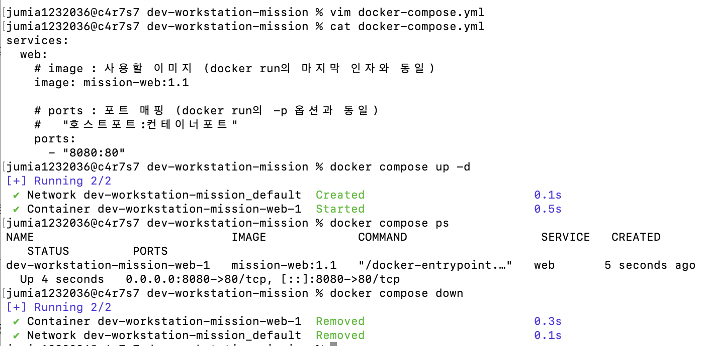

---

### 보너스 2. Docker Compose 멀티 컨테이너

> 📌 **배움 포인트**: 서비스 이름이 곧 컨테이너 간 호스트명이 된다. `web` 서비스에서 `db`로 접근할 때 IP 대신 서비스 이름을 그대로 사용 가능 → 서비스 디스커버리. 

```yaml
# docker-compose.yml
services:
  web:
    image: mission-web:1.1
    ports:
      - "8080:80"
    # depends_on : 지정한 서비스가 먼저 시작된 후 이 서비스를 실행
    depends_on:
      - db

  db:
    # 보조 서비스 예시: Redis (임시 데이터 저장소)
    image: redis:alpine
    # ports 를 열지 않으면 외부에서 접근 불가 → 내부 통신만 허용 (보안)
```

```bash
docker compose up -d
# 두 서비스(web + db)를 동시에 백그라운드로 실행

docker compose ps
# 두 컨테이너가 모두 실행 중인지 확인

# 컨테이너 간 통신 확인: web 컨테이너에서 db 서비스 이름으로 ping
docker compose exec web ping -c 3 db
# exec : 실행 중인 서비스 컨테이너 안에서 명령 실행
# ping -c 3 db : 'db' 라는 호스트명으로 3번 ping → 서비스 이름으로 통신 확인
```

> 📸 **Docker Compose 멀티 컨테이너**
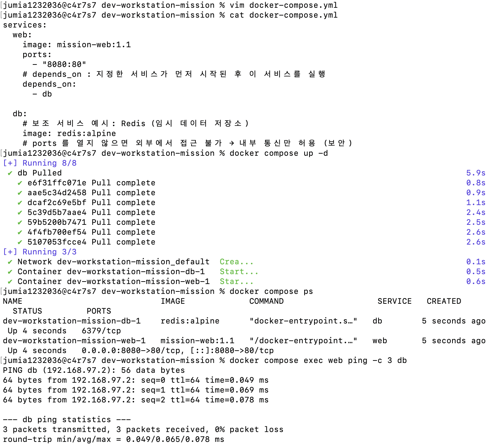

---

### 보너스 3. Compose 운영 명령어

> 📌 **배움 포인트**: 운영 관점의 "상태 확인 루틴" — 실행/로그/상태/종료를 Compose 명령 하나로 관리.

```bash
docker compose up -d
# 서비스 실행 (백그라운드)

docker compose ps
# 현재 서비스 상태 확인 (실행 중 / 중지 등)

docker compose logs
# 모든 서비스의 로그를 한번에 출력
#   -f : follow. 실시간 로그 스트리밍 (Ctrl+C로 종료)
#   서비스명을 뒤에 붙이면 해당 서비스만: docker compose logs web

docker compose down
# 서비스 중지 + 컨테이너/네트워크 제거
#   --volumes : 볼륨까지 함께 삭제할 때 추가 (데이터 초기화 시 사용)
```

> 📸 **Compose 운영 명령어**
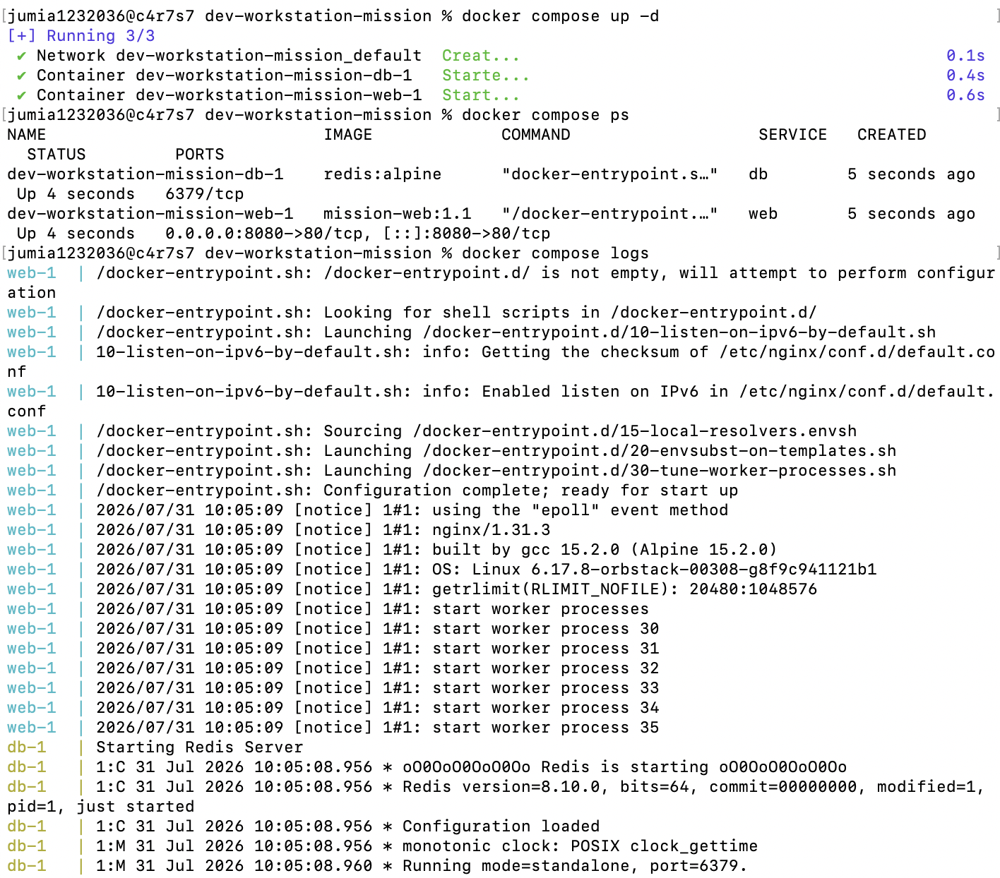
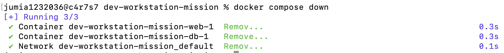

---

### 보너스 4. 환경 변수 활용

> 📌 **배움 포인트**: 설정(포트, 모드 등)을 코드에 하드코딩하지 않고 외부에서 주입 → 같은 이미지를 dev/prod 환경에서 다르게 실행 가능. 

```yaml
# docker-compose.yml
services:
  web:
    image: mission-web:1.1
    ports:
      - "8080:80"
    # environment : 컨테이너 안에 환경 변수 주입
    #   Dockerfile의 ENV(이미지를 빌드할 때 기본 환경변수)와 달리, 실행 시점에 동적으로 값을 바꿀 수 있음
    environment:
      - APP_ENV=development
      - APP_PORT=80
```

```bash
# 또는 .env 파일로 관리 (민감정보는 .gitignore에 추가)
# .env 내용 예시:
#   APP_ENV=development
#   APP_PORT=80

docker compose up -d
# Compose가 자동으로 .env 파일을 읽어 환경 변수로 주입

docker compose exec web env | grep APP
# 실행 중인 web 컨테이너 안에서 APP_으로 시작하는 환경변수를 확인하는 명령어
#   env  : 환경 변수 전체 출력
#   | grep APP : 파이프(|)로 전달해 APP 포함 줄만 필터링
```

> 📸 **Compose 환경 변수 활용**
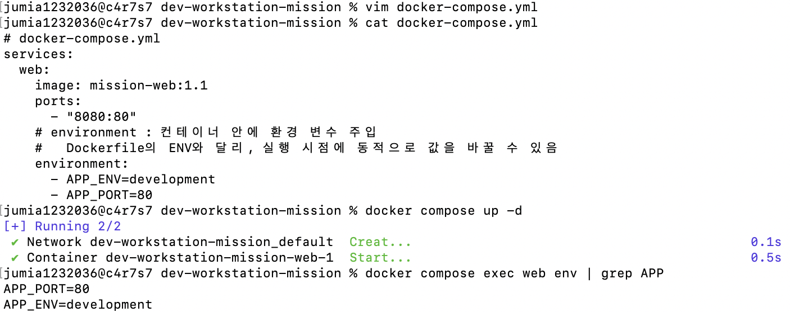

---

### 보너스 5. GitHub SSH 키 설정

> 📌 **배움 포인트**: HTTPS는 매번 토큰 입력이 필요하지만, SSH 키를 등록하면 인증 없이 push/pull 가능 → 보안성과 편의성을 동시에.

```bash
# 1) SSH 키 생성
ssh-keygen -t ed25519 -C "you@example.com"
# -t ed25519 : 키 타입 (ed25519 = 현재 권장 알고리즘, RSA보다 짧고 안전)
# -C : comment. 키 식별용 이메일 라벨
# 생성 위치: ~/.ssh/id_ed25519 (개인키) / ~/.ssh/id_ed25519.pub (공개키)

# 2) 공개키 확인 (GitHub에 등록할 내용)
cat ~/.ssh/id_ed25519.pub
# 이 내용을 복사해서 GitHub에 붙여넣기
# ※ .pub(공개키)만 공유. 개인키(id_ed25519)는 절대 노출 금지

# 3) GitHub에 등록
# GitHub → Settings → SSH and GPG keys → New SSH key → 공개키 붙여넣기

# 4) 연결 테스트
ssh -T git@github.com
# -T : 터미널 할당 없이 테스트만 수행
# 성공 시: "Hi username! You've successfully authenticated..."

# 5) 저장소 remote URL을 SSH 방식으로 변경
git remote set-url origin git@github.com:<username>/<repo>.git
# set-url : 기존 remote URL을 교체 (HTTPS → SSH)

git remote -v
# -v : verbose. 현재 등록된 remote URL 확인
```

> 📸 **GitHub SSH 키 설정**
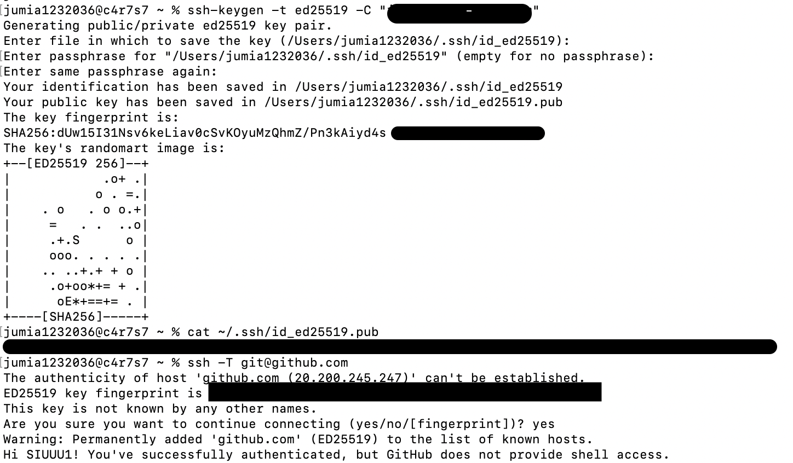
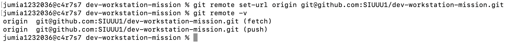

---

## 16. 트러블슈팅

> 실제 미션 수행 중 마주친 오류 → 원인 → 해결 과정을 기록했습니다.

### 문제 1. `localhost:8080` 접속 시 화면이 표시되지 않음

**증상**
브라우저로 `localhost:8080` 접속 시 페이지가 비어 있음(빈 화면).

**원인**
`site/index.html` 파일이 **저장되지 않은 상태**로 빌드되어, 빈 HTML 파일이 Docker 이미지에 복사됨.

**해결**
`index.html`을 작성·저장한 뒤 이미지를 **재빌드 → 기존 컨테이너 삭제 → 재실행**하여 정상 표시됨.

```bash
# 1) index.html 작성/저장 후 이미지 재빌드
docker build -t mission-web:1.1 .

# 2) 기존 컨테이너 삭제 (실행 중이어도 -f 로 강제 삭제)
docker rm -f mission-web

# 3) 컨테이너 재실행
docker run -d -p 8080:80 --name mission-web mission-web:1.1
```

> 📌 **정리**: 이미지는 "빌드 시점의 파일"을 그대로 담는다. 파일을 고쳤으면 **재빌드**해야 반영된다.

---

### 문제 2. 컨테이너 이름 중복

**증상**
다음 명령 실행 시 컨테이너 이름 충돌이 발생.

```bash
docker run -d --name mission-web -p 8080:80 mission-web:1.1
```

**오류**
```
Conflict. The container name "/mission-web" is already in use
```

**원인**
기존 `mission-web` 컨테이너가 이미 존재하고 있었기 때문.

**해결**
기존 컨테이너를 중지(또는 삭제)한 후 새로 실행.

```bash
docker stop mission-web       # 기존 컨테이너 중지 (이름은 여전히 점유됨)
# 이름까지 비우려면 삭제:
docker rm mission-web         # 중지된 컨테이너 제거 → 이름 재사용 가능
```

---

### 문제 3. 8080 포트 중복

**증상**
새 컨테이너 실행 시 다음 오류가 발생.

```
Bind for 0.0.0.0:8080 failed: port is already allocated
```

**원인**
기존 `mission-web` 컨테이너가 호스트의 **8080 포트를 점유**하고 있었기 때문.

**해결**
기존 컨테이너를 중지해 8080 포트를 해제한 뒤, 새 컨테이너를 다른 이름으로 실행.

```bash
docker stop mission-web       # 기존 컨테이너 중지 → 8080 포트 해제
docker run -d --name mission-web2 -p 8080:80 mission-web:1.1
```

최종적으로 컨테이너가 정상 실행됨. 아래 명령어로 상태 확인.

```bash
docker ps                     # 실행 중인 컨테이너 목록에서 정상 확인
```

